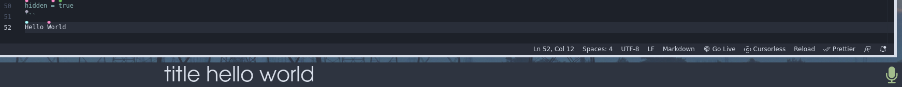

This readme is a guide for how to use Polybar as a dedicated area for your subtitles, your talon awake/asleep indicator and your parrot repeat and cancel indicator.



The main advantage of doing it this way is that the subtitles will never overlap the part of the screen you might be focusing on, for instance when editing lines of code close to the bottom of the screen.

Your use case may vary, but hopefully this can serve as a start-off point for building your own Polybar with support for whatever talon customizations you want to make use of in it.

The following is a basic polybar config file for Talon. See the [polybar wiki](https://github.com/polybar/polybar/wiki) for more information.

```
[bar/talon_bar]
bottom = true
modules-right = talon_indicator
modules-center = subtitle repeat cancel
enable-ipc = true


# Module that displays the subtitle using ipc calls.
# To set the subtitle text, run the following in your python code
# subprocess.check_call(("polybar-msg", "action", "subtitle", "send", text))
# See polybar_notifications.py, show_as_subtitle action function.

[module/subtitle]
type = custom/ipc

# Module for displaying whether talon is awake or asleep.
# In your python code, to display 'on', run the following
# subprocess.check_call(("polybar-msg", "action", "talon_indicator", "hook", "0"))
# To display 'off':
# subprocess.check_call(("polybar-msg", "action", "talon_indicator", "hook", "1"))

[module/talon_indicator]
type = custom/ipc
hook-0 = echo "on"
hook-1 = echo "off"
initial = 1

# Note that in my config, I use two separate modules of type custom/text, one containing the symbol for talon listening and the other for talon being asleep
# When waking talon, I call a hook for hiding the 'off' indicator and call a hook for showing the 'on' indicator
# See notify_wake action in polybar_notifications.py
# The reason for this is that I wanted to signal wake/sleep using text colors instead of the text content.


# When performing a repeat, a hook runs that unhides the module below, then it sets up a cron task to hide the module after a short period of time.
# See flash_repeat and flash_cancel actions in polybar_notifications.
[module/repeat]
type = custom/text
content = "REPEAT"
hidden = true

[module/cancel]
type = custom/text
content = "CANCEL"
hidden = true
```
